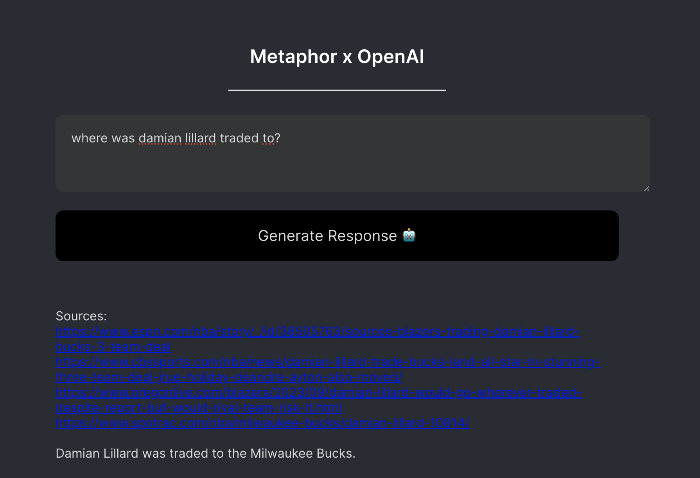

# Metaphor x OpenAI Chatbot

## 1. Overview 

This short project aims to be a chatbot that references and cites real evidence when answering user queries. 

Upon a user query, Metaphor API is used to retrieve web pages with content most likely to be helpful in answering the user. 

Next, the web page contents are processed, embedded using OpenAI, and finally stored in a vector database (cassandra/astra db). 

Lastly, the database is queried using the initial user query and the question is answered using OpenAI's LLM. Both the answer as well as the sources used are displayed in the UI.

## 2. Instructions
1. Clone this repository
2. Change OpenAI key in server/creds/settings.py (sorry for the trouble)
3. Run Server

~~~
cd ../chatbot/server
. env/bin/activate
pip install requirements.txt
flask --app app run
~~~

4. Run Client (in a separate terminal)

~~~
cd ../chatbot/client
npm i
npm run start
~~~

5. Visit localhost:3000

## 3. Closing Remarks

1. Source retrieval could be improved by using OpenAI to generate a more pointed Metaphor API prompt and parameters. Currently it seems like passing in the user question as the Metaphor does not perform optimally, as it doesn't seem able to extract the key concepts behind a query (e.g. for recent news, it does not pick up the imporantace of recency)

2. Data Extraction could be improved by featurizing the web documents more. Currently, only the text is extracted and batched into documents, but important information stored in the structure, URL, and title are largely lost. A solution to this I wasn't able to try as to insert the raw unprocessed html into the vectorestore and use a Markup-understanding LLM such as MarkupLM on huggingface to featurize/answer questions. 

3. Question answering could be improved by configuring my own answering system rather than relying on langchain's default vector database query function. This way, I could build in more complex behavior such as the ability to determine the relevance of the provided documents and accept or reject the help. Currently, it looks at the provided documents as the only source of truth. 

In sum, the current app could use improvements in both document discovery as well as document understanding, but is able to perform well on general knowledge questions where there exists many text-rich websites on the subject, e.g. biographical facts.

also, I acknowledge some best practices were thrown out the window for convenience sake but hopefully overall the project captured the right spirit.

